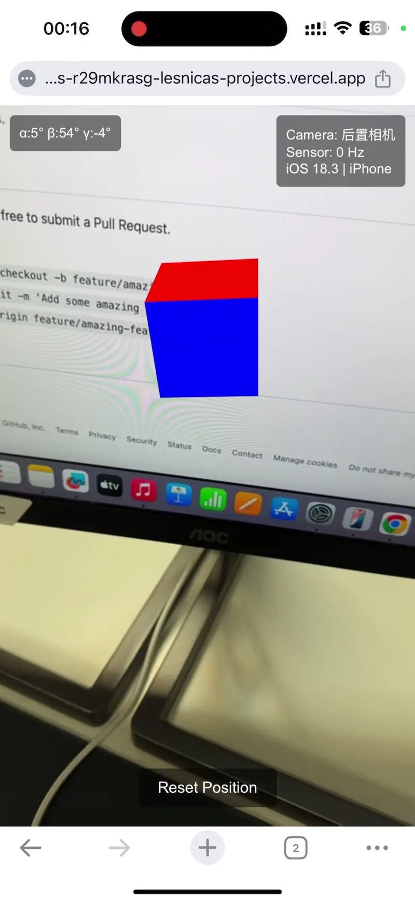

# RealityLens

A lightweight web-based Augmented Reality (AR) application that runs in mobile browsers.

**Author:** Lesnica

## Live Example

Try the live demo: [RealityLens AR Demo](https://realitylens-r29mkrasg-lesnicas-projects.vercel.app)

*Note: Access the demo on a mobile device for the best AR experience. Grant camera and orientation sensor permissions when prompted.*

### Demo Preview



## Features

- Uses mobile device's rear camera as a background for AR experiences
- Renders 3D objects over the camera feed with Three.js
- Uses device orientation sensors (gyroscope, accelerometer, magnetometer) to control the virtual camera
- Creates the illusion of 3D objects fixed in the real world space
- Performance monitoring to evaluate AR rendering on different devices

## Technology Stack

- HTML5
- CSS3
- JavaScript
- Three.js (3D rendering library)
- WebRTC (camera access)
- DeviceOrientation API (device sensors)

## Requirements

⚠️ **IMPORTANT: HTTPS IS REQUIRED** ⚠️

This application requires HTTPS to function properly, as modern browsers restrict access to camera and device orientation sensors on non-secure connections.

## Getting Started

### Setup

1. Clone the repository:
```bash
git clone https://github.com/lesnicaaa/realitylens.git
cd realitylens
```

2. Generate SSL certificates (for local development):
```bash
mkdir -p ssl
openssl req -nodes -new -x509 -keyout ssl/key.pem -out ssl/cert.pem
```

3. Start the server:
```bash
npm start
```
The server will start in HTTPS mode by default.

4. Access the application on your mobile device:
   - Use the HTTPS URL displayed in the console (e.g., https://192.168.1.123:3001)
   - Accept the security warning for self-signed certificates
   - Grant camera and orientation sensor permissions when prompted

### Usage

- Point your camera at an open space
- A colored cube will appear in the AR space
- Move your device to view the cube from different angles
- Use the "Reset Position" button to reposition the cube

## Browser Compatibility

- Works best on recent versions of Chrome and Safari
- iOS 13+ requires tapping the screen to grant device orientation permission
- Some Android devices may have limited sensor support

## Troubleshooting

- If the cube doesn't appear, check that you've granted camera permissions
- If the cube doesn't move with device orientation, check sensor permissions
- Performance may vary between devices based on sensor quality and update rates
- For iOS devices on Safari, if the camera feed doesn't appear after granting permissions, try tapping the screen or reload the page

## Development

Server options:
- HTTPS (default): `npm start`
- HTTP only: `npm run start:http`
- Both HTTP and HTTPS: `npm start -- --http`

## Deployment

### Vercel (Recommended)

This project is configured for easy deployment on Vercel:

1. Install Vercel CLI:
```bash
npm install -g vercel
```

2. Deploy to Vercel:
```bash
vercel
```

3. For production deployment:
```bash
vercel --prod
```

The deployment will automatically provide you with an HTTPS URL that works perfectly for AR applications.

## License

MIT License - see [LICENSE](LICENSE) file for details.

## Contributing

Contributions are welcome! Please feel free to submit a Pull Request.

1. Fork the repository
2. Create your feature branch (`git checkout -b feature/amazing-feature`)
3. Commit your changes (`git commit -m 'Add some amazing feature'`)
4. Push to the branch (`git push origin feature/amazing-feature`)
5. Open a Pull Request 